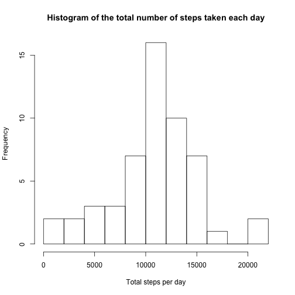
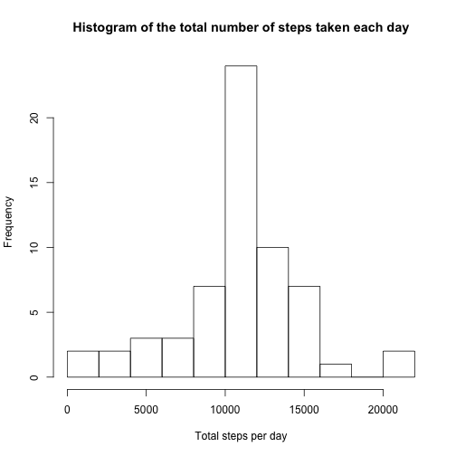

## Loading and preprocessing the data

- Loads the data into R (assuming it is in the working directory).


```r
data <- read.csv("activity.csv")
```


## What is mean total number of steps taken per day?


- Calculates the total number of steps taken per day.


```r
totals <- aggregate(steps ~ date, data, sum)
```


- Plots a histogram of the total number of steps taken each day.


```r
hist(totals$steps, breaks = 10, xlab = "Total steps per day",
     main = "Histogram of the total number of steps taken each day")
```




- Calculates the mean and median of the total number of steps taken per day.


```r
steps_mean <- mean(totals$steps, na.rm = TRUE)
steps_median <- median(totals$steps, na.rm = TRUE)
```


The mean total steps taken per day is **10766.19**, and the median total steps taken per day is **10765**.


## What is the average daily activity pattern?


- Makes a time series plot (i.e. 𝚝𝚢𝚙𝚎 = "𝚕") of the 5-minute interval (x-axis) and the average number of steps taken, averaged across all days (y-axis)


```r
intervals <- aggregate(steps ~ interval, data, mean)
with(intervals, plot(interval, steps, type = "l"))
```


- Calculates which 5-minute interval, on average across all the days in the dataset, contains the maximum number of steps?


```r
max_interval <- intervals$interval[intervals$steps == max(intervals$steps, na.rm = TRUE)]
```


The interval that contains the maximum number of steps is **835 to 840 minutes**.


## Imputing missing values


- Calculates the total number of missing values in the dataset (i.e. the total number of rows with NAs)


```r
missing <- sum(is.na(data$steps))
```


The total number of missing values in the dataset is **2304**.


- Demonstrate a strategy for filling in all of the missing values in the dataset. We will fill the missing values with the means for the corresponding 5-minute intervals as previously calculated.


- Creates a new dataset (*imputed_data*) that is equal to the original dataset but with the missing data filled in.


```r
imputed_data <- data

for (i in 1:length(imputed_data$steps)) {
      if (is.na(imputed_data$steps[i])) {
            imputed_data$steps[i] <- intervals$steps[intervals$interval ==
                                                           imputed_data$interval[i]]
      }
}
```


- Plots a histogram of the total number of steps taken each day (with imputed data).


```r
imputed_totals <- aggregate(steps ~ date, imputed_data, sum)
hist(imputed_totals$steps, breaks = 10, xlab = "Total steps per day",
     main = "Histogram of the total number of steps taken each day")
```




- Calculates the mean and median of the total number of steps taken per day (with imputed data).

- Do these values differ from the estimates from the first part of the assignment? What is the impact of imputing missing data on the estimates of the total daily number of steps?


```r
imputed_mean <- mean(imputed_totals$steps, na.rm = TRUE)
imputed_median <- median(imputed_totals$steps, na.rm = TRUE)
```


The mean total steps taken per day is **10766.19**, and the median total steps taken per day is **10766.19**. As you can see, the mean is identical to the dataset without imputation, while the median is slightly different and equal to the mean (due to imputation around the 'centre'). Overall, it is clear that the overall estimates are only slightly changed.


## Are there differences in activity patterns between weekdays and weekends?


- Creates a new factor variable in the dataset with two levels – “weekday” and “weekend” indicating whether a given date is a weekday or weekend day.


```r
imputed_data$dow <- ifelse(as.POSIXlt(as.Date(imputed_data$date))$wday == 0 |
                                 as.POSIXlt(as.Date(imputed_data$date))$wday == 6,
                          "weekend","weekday")

imputed_data$dow <- factor(imputed_data$dow,levels=c("weekday","weekend"))
```


- Makes a panel plot containing a time series plot (i.e. 𝚝𝚢𝚙𝚎 = "𝚕") of the 5-minute interval (x-axis) and the average number of steps taken, averaged across all weekday days or weekend days (y-axis).


```r
imputed_intervals <- aggregate(steps ~ interval + dow, imputed_data, mean)

library(lattice)
xyplot(steps ~ interval | dow, data = imputed_intervals, type = "l",
       xlab = "Interval", ylab = "Number of steps", layout = c(1,2))
```


